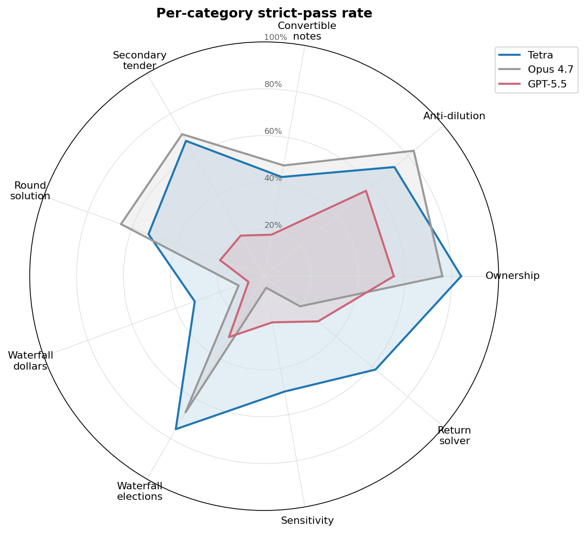

# Cap-Table Modeling Benchmark

A reproducible benchmark of AI spreadsheet agents on a Series F cap-table modeling task.

Joint work by [Acephalt](https://acephalt.com) and [DealGlass](https://dealglass.com/tetra). Methodology, scenario specifications, ground-truth oracle, scoring harness, and **all 30 raw engine output workbooks** are in this repo.

## Headline result (n=10 per engine)

| Engine | Mean strict accuracy | Audit-probe (live recompute) |
|---|---|---|
| **Tetra** | **50.06%** | **65.6%** |
| Opus 4.7 | 36.58% | 38.6% |
| GPT-5.5 | 26.90% | 44.7% |

Strict accuracy = % of 167 tracked cells within ≤0.1pp / 0.1% of canonical truth.
Audit-probe = % of cells that update correctly when the primary raise is perturbed from $30M to $33M.

Tetra–Opus 4.7 gap on strict: +13.5pp; Tetra–GPT-5.5 gap: +23pp (statistically significant under Welch's t-test with Holm-Bonferroni correction, p=0.019, Cohen's d=1.45).

## Category-level performance



The 167 cells split across nine categories. Tetra's lead concentrates on the categories where structural model construction matters: waterfall dollars, waterfall elections, sensitivity grid, return-solver. On simpler primitives — single ownership percentages, single anti-dilution ratios, single convertible note conversion — Opus 4.7 is competitive.

We also tested a fourth tool but excluded it because its backend failed roughly 60% of fires (V8 heap crashes, 30-minute poll timeouts, 502 gateway errors). Production diligence work doesn't tolerate that failure rate.

## What's in this repo

- **`scenarios/kelvin_v4/`** — the benchmark scenario
  - `spec.md` — full modeling spec (167 tracked outputs, all formulas, all conventions)
  - `prompt.md` — the exact prompt the agents saw
  - `CANONICAL_INPUTS.md` — locked input constants
  - `inputs/cap_table.xlsx` — Carta-style input workbook
  - `inputs/cap_table_perturbed.xlsx` — same workbook with raise=$33M (for audit-probe)
  - `truth/truth.json` — 167-key ground truth values, dual-build verified
  - `truth/truth.py` — Python decimal-arithmetic builder
  - `truth/ground_truth.xlsx` — formula-driven Excel builder
  - `build_excel.py`, `build_cap_table.py` — reproducible build scripts

- **`harness/`** — scoring infrastructure
  - `extract.py` — layout-agnostic extractor (defined names, label-scan fallback, per-engine layout paths)
  - `score.py` — multi-tier scoring + audit-probe sub-test
  - `reconcile.py` — dual-build truth reconciliation
  - `contracts.py` — type definitions
  - `run.py` — orchestration entry point

- **`results/`** — per-engine per-run data
  - `v4_strict_scores.csv` — strict accuracy, formula fraction, wall-clock per run (n=10 × 3 engines = 30 rows)
  - `outputs/{tetra, opus-4.7, gpt-5.5}/` — all 30 raw engine output workbooks, named `run_NN_<timestamp>_strict<X.X>.xlsx`

## Reproducing the benchmark

```bash
# 1. Verify the dual-build ground truth reconciles
python -m harness.reconcile \
    --spec scenarios/kelvin_v4/spec.md \
    --truth scenarios/kelvin_v4/truth/truth.json \
    --xlsx scenarios/kelvin_v4/truth/ground_truth.xlsx
# Expected: PASS 167/167 matched

# 2. Score an existing engine output xlsx
python -m harness.score \
    --output path/to/your/engine_output.xlsx \
    --truth scenarios/kelvin_v4/truth/truth.json \
    --report /tmp/score.md

# 3. Run the audit-probe (live-formula propagation test)
python -m harness.score.audit_probe \
    --output path/to/your/engine_output.xlsx \
    --truth-perturbed scenarios/kelvin_v4/truth/truth_perturbed.json
```

Requires Python 3.11, openpyxl, libreoffice (headless) for recalc, scipy.

## Methodology

See [METHODOLOGY.md](./METHODOLOGY.md) for how truth was built, why dual-build matters, what audit-probe tests, and the eleven measurement bugs we caught and fixed before publishing.

## Per-engine outputs

All 30 raw output workbooks are in `results/outputs/`. Inspect in Excel, re-score with the harness, or run your own audit-probe. GPT-5.5 outputs are large (1–7MB each, ~57MB total) — the model generates elaborate formula structures with hundreds of thousands of cells. Tetra and Opus 4.7 outputs are 20–70KB each.

## Caveats and limits

- **n=10 per engine on a single benchmark family.** The Tetra–GPT-5.5 gap (+23pp) is statistically significant; the Tetra–Opus 4.7 gap (+13.5pp) is directional and would benefit from n=20+ to clear standard significance thresholds.
- **The agent edge is conditional on regime.** On templated tasks (agent fills an empty workbook with named cells), all engines tie at ~70%. On simple cap-tables (3 rounds, single priced round), Opus 4.7 wins. This benchmark was designed to test the regime VC analysts actually live in: complex from-scratch deal modeling.
- **Pre-publish bugs caught.** Five skeptical audits during the build caught 11 measurement issues (extractor disambiguation, tolerance routing, scoring-tier key-set mismatch). All fixed before these numbers were finalized. The audits and the fixes are documented in METHODOLOGY.md.

## Citation

> Acephalt + DealGlass (2026). Benchmarking Agents for Cap Table Modeling. Available at: https://github.com/arthursolwayne/cap-table-bench

## Contact

- Questions about methodology, scoring, or reproducibility: file an issue on this repo
- Requests for engine output workbooks: contact via the linked sites above
- Press / partnerships: same

## License

Code: MIT. Scenario specifications and benchmark data: CC-BY-4.0.
